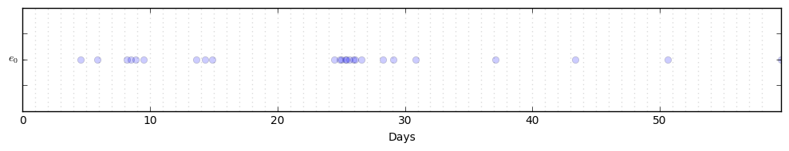
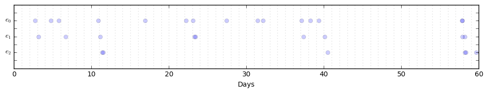
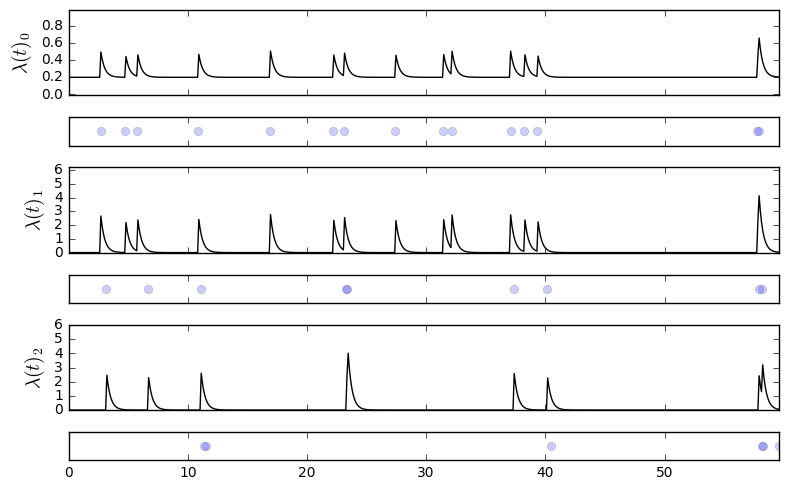

# Python class for Multivariate Hawkes Processes

This repo provides a class `MHP` for doing basic experimentation with a Hawkes process.  It works for both uni- and multivariate processes, and implements both synthetic sequence generation and parameter estimation of a known sequence.  I use a MAP EM algorithm for parameter estimation that is described in [this unpublished report](https://stmorse.github.io/docs/6-867-final-writeup.pdf) for the univariate case, and [my masters thesis](https://stmorse.github.io/docs/orc-thesis.pdf) for the multivariate case.

There is a blog post [here](https://stmorse.github.io/journal/Hawkes-python.html) describing more details, such as theoretical preliminaries and some suggested usage and further reading. 


# Contents

The `MHP.py` file contains a single class, `MHP`.  The core methods are:

1. `generate_seq`: generates synthetic sequences given parameter values specified in the constructor.  Uses Ogata thinning with two speedups/modifications: it saves the rates at the moment of the last event, and it does the "attribution/rejection" test as a weighted random sample (using NumPy's `random.sample`) instead of, e.g., a for-loop.

2. `EM`: uses a Bayesian EM algorithm to learn parameters, given a sequence and estimates of `alpha`, `mu`, and `omega`.  It treats `omega` as a hyperparameter and does not optimize over this parameter.  For more details see [the report](https://stmorse.github.io/docs/6-867-final-writeup.pdf), [my thesis](https://stmorse.github.io/docs/orc-thesis.pdf), or [this blog post](https://stmorse.github.io/blog).

There are also two visualization methods, `plot_events` (which plots only the time series of events), and `plot_rates` (which plots the time series with the corresponding conditional intensities, currently only implemented for `dim=3`).


# Usage

You can test basic functionality using default parameters as follows:
```python
from MHP import MHP
P = MHP()
P.generate_seq(60)
```
which will initialize a univariate process with parameters `mu=[0.1]`, `alpha=[[0.5]]`, and `omega=1.0`.  This sequence is stored as `P.data`, a `numpy.ndarray` with 2 columns: the first column with the timestamps, the second with the stream assignment (in this case there is only one stream).

You can then plot the events with
```python
P.plot_events()
```



For a more interesting test, try engineering your own parameters.  Here is an example with `dim=3`:
```python
m = np.array([0.2, 0.0, 0.0])
a = np.array([[0.1, 0.0, 0.0], 
              [0.9, 0.0, 0.0],
              [0.0, 0.9, 0.0]])
w = 3.1

P = MHP(mu=m, alpha=a, omega=w)
P.generate_seq(60)
P.plot_events()
```



We can also look at the conditional intensities along with the time series of events:




We can learn the parameters of an already generated sequence by simply calling `EM` with some guesses at `alpha` and `mu` (and a hyperparameter `omega`),
```python
mhat = np.random.uniform(0,1, size=3)
ahat = np.random.uniform(0,1, size=(3,3))
w = 3.

P.EM(ahat, mhat, w)
```
which will give output something like:
```
After ITER 0 (old: -10000.000 new: -0.129)
 terms 5.1766, 17.4638, 8.5362
After ITER 10 (old: -0.129 new: -1.349)
 terms -20.8908, 11.8172, 14.1828
Reached stopping criterion. (Old: -1.349 New: -1.350)

(array([[ 0.0223,  0.1475,  0.    ],
        [ 0.5954,  0.    ,  0.    ],
        [ 0.    ,  0.625 ,  0.    ]]), 
 array([ 0.2038,  0.0046,  0.    ]))
```

This is already a reasonable approximation to the actual ground truth values from above, without including regularization, cross-validation, a larger sample, etc.


# Summary

This is a bare bones collection of code that is hopefully helpful to someone dipping his/her toes in the waters of multivariate point processes.  For more robust packages, or a more indepth look at behind-the-scenes, check out [this blog post](https://stmorse.github.io/journal/Hawkes-python.html) which covers some basic theoretical concepts and also links to some other more expansive code repos out there.

