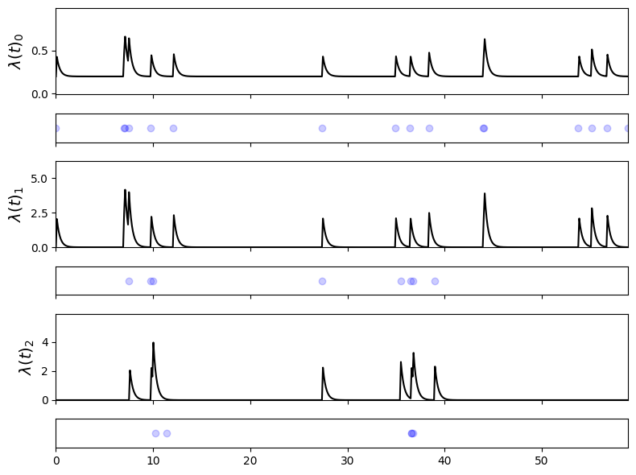

# Python class for Multivariate Hawkes Processes

**UPDATED: 27 August 2025**

This repo provides a class `MHP` for doing basic experimentation with a Hawkes process.  It works for both uni- and multivariate processes, and implements both synthetic sequence generation and parameter estimation of a known sequence.  I use a MAP EM algorithm for parameter estimation that is described in [this preprint](https://arxiv.org/abs/2005.06542) and in a bit more detail in [my masters thesis](https://stmorse.github.io/docs/orc-thesis.pdf), both for the multivariate case.  Please consider citing the preprint if you find the MAP EM approach helpful for your research, thank you!

There is a blog post [here](https://stmorse.github.io/journal/Hawkes-python.html) describing more details, such as theoretical preliminaries and some suggested usage and further reading (and a follow-up post on the tricky log-likelihood function [here](https://stmorse.github.io/journal/hawkes-LL.html)).


# Contents

## Update (August 2025)

**I updated the code in three ways.**  

1. Modified the `train` method (previously `EM`) with some matrix magic that dramatically speeds up training.  

2. The `train` method returns the branching matrix (as `pii` and `pij`, see comments, blog, and below examples).

3. Restructured the class a bit --- for example, it doesn't contain its own data, and plotting methods are separate.

The updated version is in `MHP.py`, but I've kept the older version in `MHP_archive.py` in case you want it for whatever reason. Or if it turns out I've got a bug in the new stuff.

I've also added a **demo Jupyter notebook** to help jump-start your fiddling.


## Overview

The `MHP.py` file contains a single class, `MHP`.  The core methods are:

1. `generate`: generates synthetic sequences given parameter values specified in the constructor.  Uses Ogata thinning with two speedups/modifications: it saves the rates at the moment of the last event, and it does the "attribution/rejection" test as a weighted random sample (using NumPy's `random.sample`) instead of, e.g., a for-loop.

2. `train`: uses a maximum-aposteriori (MAP) EM algorithm to learn parameters, given a sequence and estimates of `alpha`, `mu`, and `omega`.  It treats `omega` as a hyperparameter and does not optimize over this parameter.  For more details see [the report](https://stmorse.github.io/docs/6-867-final-writeup.pdf), [my thesis](https://stmorse.github.io/docs/orc-thesis.pdf), or [this blog post](https://stmorse.github.io/blog).

There are also two visualization methods, `plot_events` (which plots only the time series of events), and `plot_events_and_rates` (which plots the time series with the corresponding conditional intensities, currently only implemented for dimensions 1, 2, or 3).


# Usage

You can test basic functionality using default parameters as follows:
```python
from MHP import *
P = MHP()
seq = P.generate(60)
```
which will initialize a univariate process with parameters `mu=[0.1]`, `alpha=[[0.5]]`, and `omega=1.0`.  This sequence is stored as `P.data`, a `numpy.ndarray` with 2 columns: the first column with the timestamps, the second with the stream assignment (in this case there is only one stream).

You can then plot the events with
```python
plot_events(seq)
```


We can also visualize the events with the conditional intensity plotted on top:


This shows the characteristic clustering of a self-exciting process.

For a more interesting test, try engineering your own parameters.  Here is an example with `dim=3`:
```python
m = np.array([0.2, 0.0, 0.0])
a = np.array([[0.1, 0.0, 0.0], 
              [0.9, 0.0, 0.0],
              [0.0, 0.9, 0.0]])
w = 3.1

P = MHP(mu=m, alpha=a, omega=w)
seq = P.generate_seq(60)
plot_events(P, seq)
```



Notice how the events in Process 1 (the middle row) are due to increased rates resulting from events in Process 0 (the top row), and similarly Process 1 to 2.  Notice that only Process 0 is structured to increase its own probability of event (self-exciting).  Compare this with the parameters.

We can learn the parameters of an already generated sequence by simply calling `train` with some guesses at `alpha` and `mu` (and a hyperparameter `omega`),
```python
mhat = np.random.uniform(0,1, size=3)
ahat = np.random.uniform(0,1, size=(3,3))
w = 3.

Ah, mh, pii, pij = P.train(seq, Ahat=ahat, mhat=mhat, omega=w)
```
which will give output something like:
```
Doing precomputations ... 0.000
Iter 0 (LL: -1.4284488943433509) ... 0.002
Iter 10 (LL: -2.0390966330052676) ... 0.004
Iter 20 (LL: -2.0317389709345473) ... 0.006
Iter 30 (LL: -2.0308961326542385) ... 0.008
Iter 40 (LL: -2.030794277996135) ... 0.009
Iter 50 (LL: -2.030781792932611) ... 0.011
Iter 60 (LL: -2.030780249397425) ... 0.012
Iter 70 (LL: -2.0307800573573216) ... 0.014
Iter 80 (LL: -2.0307800333489143) ... 0.016
Iter 90 (LL: -2.030780030336401) ... 0.020
Reached max iter 100 (LL: -2.030780030336401) ... 0.022
```

And shows parameter estimates for the base rates `m` and kernel matrix `A` as
```
[[0.    0.    0.   ]
 [0.133 0.    0.028]
 [0.    0.128 0.18 ]]
[0.272 0.    0.   ]
```

This is already a reasonable approximation to the actual ground truth values from above, with a small sample.  We have also not introduced regularization, through the `tmx` and `smx` optional parameters (see blog for more info).

Due to our estimation method (EM) we also get an estimate for the branching matrix $P$.


Recall this matrix (the estimated latent branching structure) is row-stochastic, with each entry $p_{ij}$ representing the probability that event $i$ was caused by event $j$.  High values along the diagonal indicate self-exciting events.  We see many rows with off-diagonal values, indicating probability of a previous "parent" event causing it.


# Summary

This is a bare bones collection of code that is hopefully helpful to someone dipping his/her toes in the waters of multivariate point processes.  For more robust packages, or a more indepth look at behind-the-scenes, check out [this blog post](https://stmorse.github.io/journal/Hawkes-python.html) which covers some basic theoretical concepts and also links to some other more expansive code repos out there, or the follow-up [here](https://stmorse.github.io/journal/hawkes-LL.html) on the log-likelihood function specifically.  

You might also be interested in this post on the [log-Gaussian Cox process](https://stmorse.github.io/journal/lgcp.html), a process which similar to Hawkes is doubly-stochastic, but unlike Hawke's endogenous self-exciting nature, has an exogenous source of randomness (in its case, a GP).

